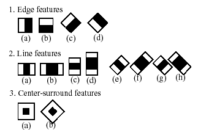
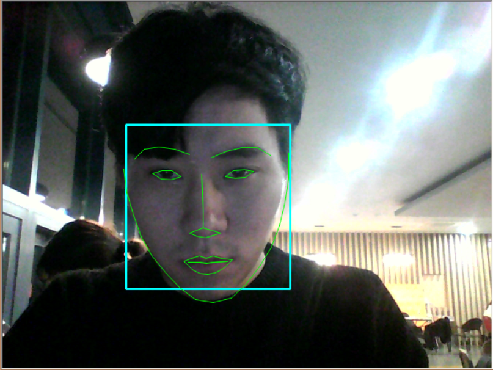
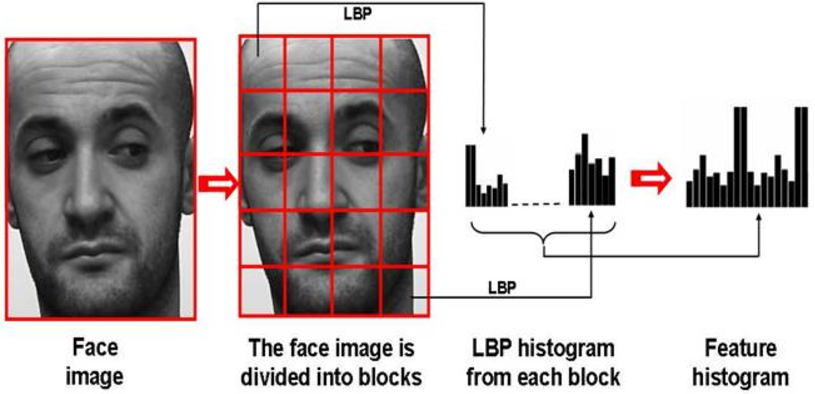

# 졸업 작품
얼굴인식을 이용한 IoT 도어락
<br>
<br>

## 1. 작품 주제
기존의 디지털 도어락에 영상인식 시스템을 도입한 것으로써, 얼굴인식 식별을 통해 통제하는 도어락입니다. <br>

얼굴을 식별할 카메라는 도어락 앞에 사람이 있을 때만 자동으로 작동합니다. <br>
얼굴인식 시도 시 DB에 없는 사람이면 비상음이 발생하며, 그렇게 3회 이상 하면 도어락 사용자의 스마트폰으로 <br>
알림이 발생합니다.
<br>

## 2. 개발 환경
<br>
h/w 파트
* Linux <br>
* C++ <br>
* Rasberry Pi 3 model <br>
* OpenCV 3.4.3 API <br><br>
<br>
app 파트
* Android studio <br>
* JAVA <br>

<br>
## 3. 개발 기간
<br>
* 프로젝트 기간  :  18.9.1 ~ 18.11.28 <br>
* 프로젝트 인원  :  4명
<br>
## 4. OpenCV API
<br>
```
얼굴 검출  :  Haar-based cascade
특징 검출  :  face-landmark
얼굴 인식  :  LBPH ( Local Binary Patterns Histogram )
```

 

### 4.1 얼굴 검출 (face-detect)
<br>
하르 기반 분류기(Haar-based cascade)는 매우 단순한 특징들을 조합하여 객체를 찾아낸다. <br>
그 특징값은 흰색 영역의 화소값의 합과 검은색 직사각형 영역의 화소값의 합의 차로 정의된다.
<br>
 
<br>
opencv의 분류기는 1,000개 이상의 얼굴 영상과 10,000개 이상의 얼굴이 아닌 영상을 사용하여 학습되었다.<br>
미리 학습된 이 분류기를 이용하여 face detect를 시도한다.

이때 라즈베리파이의 계산량을 줄이기 위해 스케일을 줄여 계산한다.
<br>
```c++
float scale = img.cols / (float)scaledWidth;    // scale = 1280 / 320 = 4
int scaledHeight = cvRound(img.rows / scale);   // 960 / 4 = 240 ,  높이 종횡비에 맞게 조정

if (img.cols > scaledWidth)   // 1280 > 320  축소하고자하는 값보다 크면 축소하겟다
	resize(img, scaledFrame, Size(scaledWidth, scaledHeight));  // 해당 size 규격으로 resize화
else
	scaledFrame = img;
```

명암도 영상(haar cascade 적용하기 위함)으로 만든 후 화질 개선을 위해 히스토그램 평활화 과정을 거친다.<br>
전처리 과정이 끝난 프레임을 haar cascade에 넣고 검출한다.
<br>
```c+++
cvtColor(scaledFrame, equal_frame, CV_BGR2GRAY);  // 명암도 영상으로 변환
		
equalizeHist(equal_frame, equal_frame);  // 평활화
cascade.detectMultiScale(equal_frame, objects, 1.1, 2, 0 | CASCADE_SCALE_IMAGE, Size(100, 100), Size(250,250));  	 // 얼굴 검출
```
<br>
### 4.2 특징 검출 (face-landmark)
<br>
이 과정은 얼굴 인식의 전처리 과정으로, 얼굴 인식의 효율 높이기 위한 알고리즘이다.<br>
이미지에서 얻은 얼굴 matrix의 68개 랜드마크를 검출한다.
<br>
 
<br>
```c++
Ptr<Facemark> facemark = FacemarkLBF::create();
facemark->loadModel(RootDirectory + modelDir + faceMarkFile);

...

// 랜드마크 검출
bool success = facemark->fit(frame, faces, landmarks);
```
<br>
검출한 랜드마크를 가지고 얼굴 좌표를 찾아내서 회전 보정을 처리한다.
이 과정은 얼굴을 정면으로 위치시키기 위함이다.
<br>
```c++
find_center(eyes, landmarks[0]);
eyes[1] -= (Point2f)faces[0].tl(); // 여백 이동

...

void find_center(Point2f eyes[], vector<Point2f> &landmarks)
{
	eyes[0] = landmarks[37]; // 왼쪽 눈
	eyes[1] = landmarks[27]; // 코
	eyes[2] = landmarks[44]; // 오른쪽 눈
}
Mat rot_mat = rotated_face(copy, eyes);

...

Mat rotated_face(Mat face, Point2f eyes[])
{
   Point2f delta = eyes[2] - eyes[0];  // 차분, ( 어느 것이 왼쪽 눈인지 알 수 없으므로 )
	double angle = fastAtan2(delta.y, delta.x);   // 기울기 계산 ( atan2() * 180.0/CV_PI )
	double desiredLen = (DESIRED_RIGHT_EYE_X - DESIRED_LEFT_EYE_X); // 보정 길이
	double len = sqrt(delta.x * delta.x + delta.y * delta.y);   // 눈 사이 거리
	double scale = desiredLen * DESIRED_FACE_WIDTH / len;  // 보정 비율 계산
   
	Point2f eyesCenter = eyes[1];  // 눈 사이 중심 찾기
	// 원하는 각도 & 크기에 대한 변환 행렬 취득
	Mat rot_mat = getRotationMatrix2D(eyesCenter, angle, scale);   // affine 변환 행렬 ( 평행 이동은 안들어가 있음 	// 원하는 중심으로 눈의 중심 이동
	double ex = DESIRED_FACE_WIDTH * 0.5f - eyesCenter.x;
	double ey = DESIRED_FACE_HEIGHT * DESIRED_LEFT_EYE_Y - eyesCenter.y;
	rot_mat.at<double>(0, 2) += ex;  // affine 행렬(2x3) 중 평행이동 원소는 (0,2) (1,2)
	rot_mat.at<double>(1, 2) += ey;  
	// 회전 보정 수행 - 얼굴 기울기 보정
	Mat wraped = Mat(DESIRED_FACE_HEIGHT, DESIRED_FACE_WIDTH, CV_8U, Scalar(200));   // 최종 반환 얼굴 영상 (70x70)
	warpAffine(face, wraped, rot_mat, wraped.size(), 
	INTER_LINEAR, BORDER_CONSTANT, Scalar(255,255,255)); // src, dst, rot_mat, size  => 원본(src)를 rot_mat으로 보정하여 dst에 담는다

```
<br>
### 4.3 얼굴 인식 (face-recognizer)
<br>
LBPH (Local Binary Patterns Histogram)은 이미지의 질감 표현 및 얼굴인식에 사용하는 알고리즘이다.<br>

이미지를 여라개의 블락으로 분할한다. 그리고 각 블락에서 LBP히스토그램을 구하고 그것들을 연결시킨다.<br>
이 정보를 가지고 간단한 얼굴 인식 프로그램을 구현할 수 있다.
<br>

<br>
LBPH의 유사도는 70이하 정도로 잡고 얼굴 인식을 판별한다. 숫자를 올리면 얼굴 인식은<br>
잘 되지만 엉뚱한 사람이 인식될 가능성이 높아진다. 따라서, 여러 장소를 옮기면서 실험한 결과 70정도가 나아서 설정하였다.
<br>
```c++
Ptr<face::FaceRecognizer> model = LBPHFaceRecognizer::create();
model->read(RootDirectory + modelDir + modelFile); // 모델 xml 로드

...

int label;
double confidence = 0.0;
model->predict(soft_mat, label, confidence); // confidence 70 이하
```
<br>

## 5. 작품 관련
<br>
작품 영상 <br>

* (https://www.youtube.com/watch?v=g6qxL9B0ags&feature=youtu.be)
<br>
 
<br>
win에서 테스트한 후 linux의 이식하여 테스트 중인 사진
<br>

<br>
작품의 대략적인 외관 모습
<br>

<br>
졸업작품 상장
<br>
